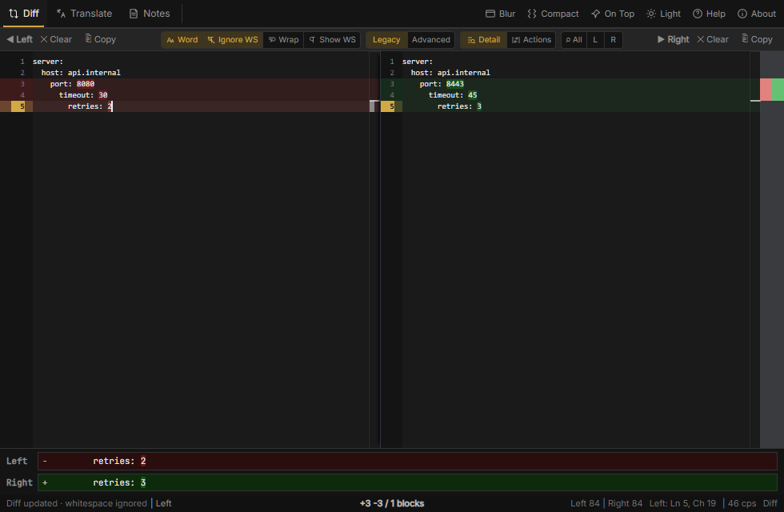
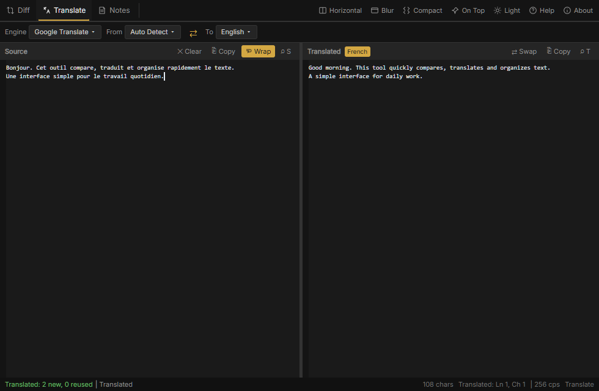
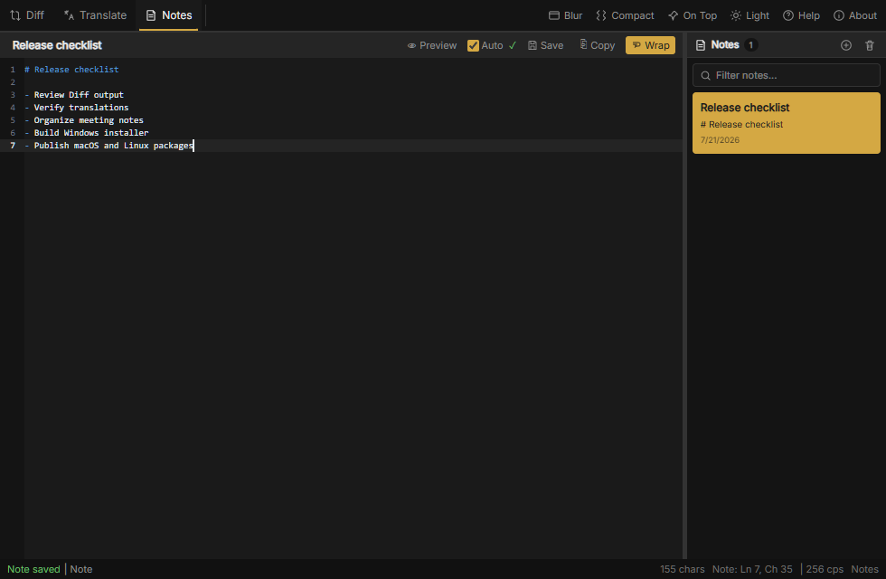

# SbtDeskTool

SbtDeskTool is a compact desktop toolbox for comparing, translating and organizing text on Windows, macOS and Linux.

### Diff



### Translate



### Notes



## Features

- **Diff:** editable side-by-side comparison, two alignment algorithms, word-level highlighting, whitespace controls, optional copy/revert actions, focused-line detail and both common and per-editor search.
- **Translate:** automatic translation, language detection, incremental reuse of unchanged lines, language swap, common Source/Translated search and network fallback strategies.
- **Notes:** local Markdown notes with line numbers, filtering, preview, auto-save, resizable list and quick selection in Compact mode.
- **Workspace:** independent wrap, zoom and status state for each tab; dark/light themes; drag-and-drop; Compact mode; always-on-top; tray controls; and a global show/hide shortcut.
- **Updates:** signed in-app updates and platform-native release packages.

## Supported platforms

| Platform | Application and installer packages |
| --- | --- |
| Windows | Versioned portable `.exe` and per-user NSIS installer |
| macOS | Universal Apple Silicon/Intel `.app` and `.dmg` |
| Linux | AppImage, `.deb` and `.rpm` |

Window effects follow platform capabilities: Windows provides the complete effect set, macOS provides native blur/frosted effects, and Linux uses a solid window because transparency is controlled by the desktop compositor.

## Search shortcuts

- `Ctrl+F` in any text area: search only the focused text area.
- `Ctrl+Shift+F` in Diff or Translate: search both text areas in that tab.
- `Enter` / `Shift+Enter`: next / previous common-search result.
- `Escape`: close the active search or dialog.

Notes intentionally has no common search; use `Ctrl+F` inside its text area or filter the note list by title and content.

## Requirements

All platforms require Node.js 22 or newer and the stable Rust toolchain.

- **Windows:** Windows 10/11 with WebView2 and Visual Studio 2022 Build Tools with **Desktop development with C++**.
- **macOS:** Xcode Command Line Tools.
- **Linux (Ubuntu/Debian):** `libwebkit2gtk-4.1-dev`, `libappindicator3-dev`, `librsvg2-dev`, `patchelf` and `rpm`.

## Development

```bash
npm ci
npm run tauri dev
```

Verification commands:

```bash
npm run build
npm run fmt:rust
npm run test:rust
npm run lint:rust
```

## Local test build

Windows keeps one convenience script for producing a temporary test executable. It does not change the release version or build an installer:

```powershell
.\build.bat
```

Outputs:

```text
target\test-build\release\sbt-desk-tool.exe
```

The Windows script uses a dedicated directory, so an older running copy of the application cannot lock the new executable. Installers and release versions are produced only by GitHub Actions.

The same package command works natively on macOS:

```bash
npm run package
```

And on Linux:

```bash
npm run package
```

Packages must be built on their native operating system. GitHub Actions verifies all three platforms, builds a universal macOS package, uploads the Windows portable executable, and keeps the release as a draft until every platform succeeds. Pushes to `main`, version tags and manual workflow runs all produce packages.

## Version and releases

Release versions use `MAJOR.YY.M.D-BUILD`, for example `1.26.7.21-38`. `MAJOR` is configured manually in `version.json` and can be changed for a major product release. Local test builds retain the current version. GitHub Actions chooses the greater of the next tracked `BUILD` and its increasing workflow run number, so release builds advance without being affected by local testing. Build tooling stores the SemVer-compatible form `MAJOR.YY.M-D.BUILD` internally while the application displays the release form.

The updater reads signed release metadata from:

```text
https://github.com/SabiTechHolding/SbtDeskTool/releases/latest/download/latest.json
```

Configure `TAURI_SIGNING_PRIVATE_KEY` and `TAURI_SIGNING_PRIVATE_KEY_PASSWORD` as repository secrets before publishing. Private keys and `.env` must not be committed.

The macOS package uses an ad-hoc signature by default so Apple Silicon does not treat the downloaded application as damaged. For public distribution without Gatekeeper warnings, also configure the Apple certificate and notarization secrets documented in `.env.example`. Windows Authenticode signing likewise requires a separate trusted code-signing certificate; updater signatures do not replace operating-system code signing.

## Project structure

```text
src/                    Application interface and text tools
src-tauri/src/          Native commands, engines, persistence and window control
src-tauri/icons/        Cross-platform application icons
docs/screenshots/       Product screenshots
scripts/                Versioning and signing helpers
.github/workflows/      Verification and release workflow
```
